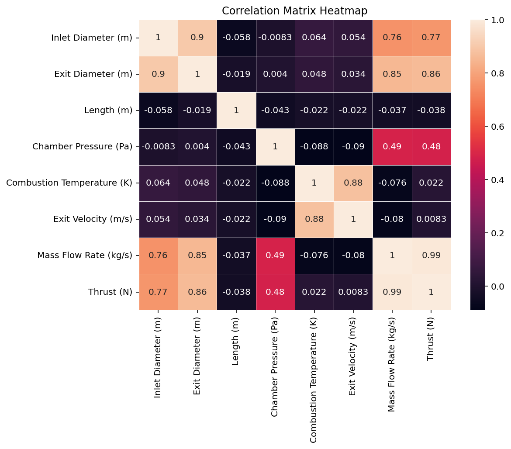
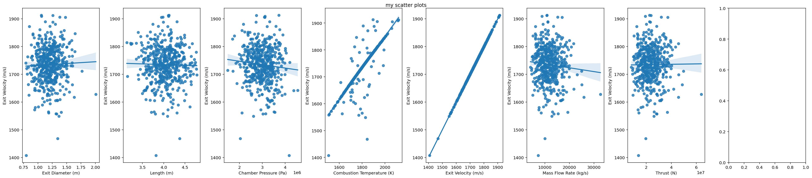
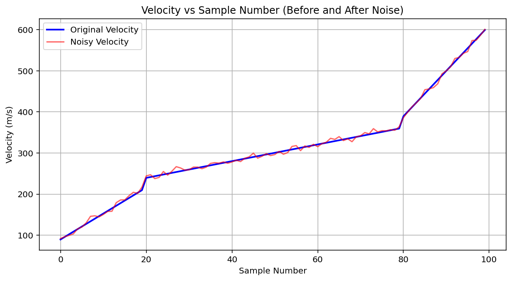
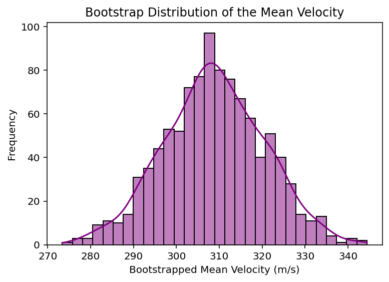
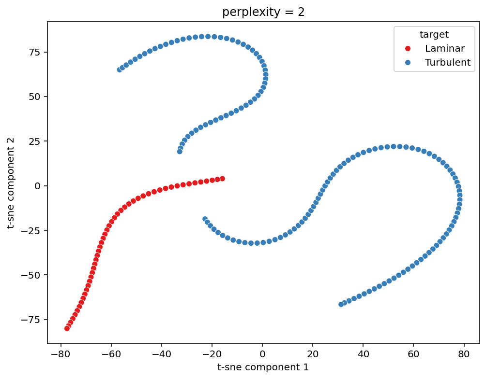

# FlowData — Aerospace ML Pipeline

Machine learning experiments on aerospace and engine datasets, covering the full pre-processing pipeline from raw EDA through to model training and evaluation.

---

## Aerospace Scripts

### `ML_application.py` — EDA on Engine Data
**Dataset:** `csvs/Physically_Coupled_Engine_Dataset.csv`

Full exploratory data analysis workflow:
- Shape, columns, head, and descriptive statistics
- Missing value detection per column
- Histograms for all columns, box plot + strip plot for exit velocity
- **Outlier detection** via IQR (Q1 − 1.5×IQR, Q3 + 1.5×IQR)
- **Pearson correlation heatmap** across all features
- Regression scatter plots for every feature vs. Exit Velocity




---

### `Adding_Noise.py` — Data Augmentation, Encoding & Imbalance Handling
**Dataset:** `csvs/Ascending_Mach_Dataset_Imbalanced.csv`

End-to-end pre-processing and augmentation pipeline before model training:

| Step | Description |
|------|-------------|
| **Velocity derivation** | Computes velocity from Mach and static temperature: `V = Mach × √(γRT)` |
| **Gaussian noise injection** | Adds Normal(0, σ=5) noise to velocity to simulate sensor variance — original (blue) vs noisy (red) shown below |
| **Bootstrapping × 1000** | Resamples with replacement 1000 times; plots bootstrapped mean distribution to quantify sampling uncertainty |
| **Flow type classification** | Labels each point Subsonic (<0.8), Transonic (0.8–1.1), or Supersonic (>1.1) Mach |
| **One-Hot Encoding** | Encodes categorical `Flow_Type` for use in regression |
| **Random Forest + 3-fold CV** | Trains `RandomForestRegressor`, reports MSE/RMSE per fold |
| **Random Under-Sampling** | Balances class counts so the model isn't biased toward the dominant flow regime |
| **Train/Test Split** | Partitions data 67/33 for final model evaluation |




---

### `tSNE.py` — Dimensionality Reduction & Clustering
**Dataset:** `csvs/target.csv` (laminar vs. turbulent flow labels)

- **StandardScaler** normalises the four continuous features
- **t-SNE** (perplexity = 2) reduces to 2-D — laminar points cluster tightly, turbulent points spread widely, consistent with their physical behaviour
- **KMeans** (k = 4) clusters the data and appends labels for inspection



---

### `Training_Test.py` — Neural Network Binary Classifier
**Dataset:** Pima Indians Diabetes (fetched from GitHub)

- **Keras Sequential model** with Dense layers
- Evaluates with confusion matrix, classification report, and ROC/AUC curve

---

## Datasets (`csvs/`)

| File | Description |
|------|-------------|
| `Physically_Coupled_Engine_Dataset.csv` | Engine parameters including exit velocity |
| `Aerospace_Specs_Dataset.csv` | Aerospace component specifications including velocity |
| `Ascending_Mach_Dataset_Imbalanced.csv` | Mach/temperature during ascent (class-imbalanced) |
| `Ascending_Mach_Dataset.csv` | Balanced version of the ascent dataset |
| `Engine_Design_Parameters_Dataset.csv` | Engine design parameters |
| `Flat_Plate_Heat_Transfer_Data.csv` | Flat plate heat transfer measurements |
| `target.csv` | Flow classification data (laminar vs. turbulent) |

---

## California Housing (Side Experiments)

Separate scripts using the scikit-learn California Housing dataset to practice feature engineering and regression — not part of the main aerospace pipeline.

- **`Cal_Housing.py`** — derived features (log, exp, squared, interaction), MinMaxScaler normalisation, correlation heatmap
- **`Cal_Housing_Lin_Reg.py`** — degree-3 polynomial expansion, Linear Regression, feature importance by coefficient magnitude

---

## Key Concepts Covered

EDA · Outlier detection (IQR) · Pearson correlation · Feature engineering · MinMaxScaler · Gaussian noise augmentation · Bootstrapping · One-Hot Encoding · Class imbalance (under-sampling) · Cross-validation · Random Forest · Polynomial regression · t-SNE · KMeans · Keras Sequential NN · ROC/AUC

---

## Dependencies

```
pandas · numpy · matplotlib · seaborn · scikit-learn · imbalanced-learn · tensorflow/keras
```
